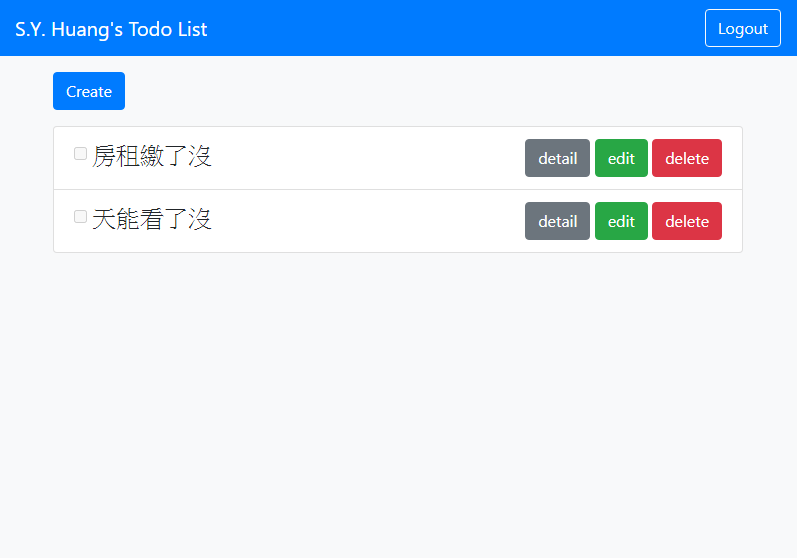

# Todo 清單
建立屬於自己的代辦事項清單

# 功能描述
- 可新增代辦事項
- 可察看代辦事項
- 可修改代辦事項
- 可刪除代辦事項
- 可使用 Facebook 登入

# 預覽畫面

# 環境建置與需求
- bcryptjs: "^2.4.3",
- connect-flash: "^0.1.1",
- dotenv: "^8.2.0",
- express: "^4.17.1",
- express-handlebars: "^5.1.0",
- express-session: "^1.17.1",
- method-override: "^3.0.0",
- mysql2: "^2.1.0",
- passport: "^0.4.1",
- passport-facebook: "^3.0.0",
- passport-local: "^1.0.0",
- sequelize: "^6.3.5",
- sequelize-cli: "^6.2.0"
  }

# 安裝與執行步驟
1. 下載專案
> git clone https://github.com/ShengYaoHuang/todo-sequelize.git

2. 進入專案資料夾
> cd restaurant_list

3.下載套件
> npm install

4. 安裝種子資料
> npm run seed

5. 執行程式
> npm run dev
